```python
import numpy as np
import matplotlib.pyplot as plt
```


    ---------------------------------------------------------------------------

    ModuleNotFoundError                       Traceback (most recent call last)

    <ipython-input-209-bd177e4be8d7> in <module>
          1 import numpy as np
          2 import matplotlib.pyplot as plt
    ----> 3 import napari


    ModuleNotFoundError: No module named 'napari'


```python
import napari
```


    ---------------------------------------------------------------------------

    ModuleNotFoundError                       Traceback (most recent call last)

    <ipython-input-211-1e1049a33073> in <module>
    ----> 1 import napari


    ModuleNotFoundError: No module named 'napari'


```python
from skimage import io
im = io.imread('stack140.tif')
```


```python
plt.imshow(im[20,:,:])
```


    <matplotlib.image.AxesImage at 0x22e77248848>


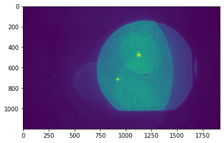


```python
im_cut=im[:,120:1050,700:1500]
```


```python
plt.plot(im_cut[:,300,700])
```


    [<matplotlib.lines.Line2D at 0x22e774f3608>]


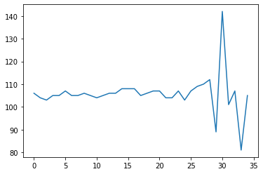


```python
ans=[]
stack0=im_cut[:,300,500]*1.0
for i in range(0,stack0.shape[0]-5):
    valTemp=np.power(stack0[i+1]-stack0[i+3],2)-np.multiply((stack0[i]-stack0[i+2]),(stack0[i+2]-stack0[i+4]))
    ans.append(valTemp)
```


```python
plt.plot(ans)
```


    [<matplotlib.lines.Line2D at 0x22e770c1b88>]


```python
plt.imshow(im_cut[31,:,:])
```


    <matplotlib.image.AxesImage at 0x22e77564fc8>


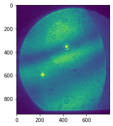


```python
size = im_cut.shape
im_stack=im_cut.reshape((size[0],size[1]*size[2]))


```


```python
size
```


    (35, 930, 800)


```python
plt.plot(im_stack[2,:])
```


    [<matplotlib.lines.Line2D at 0x22e7717de08>]


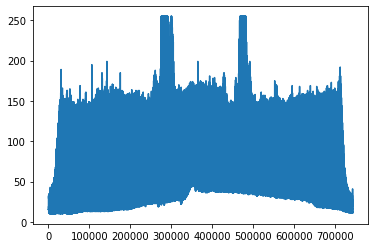


```python
stack0 = im_stack
```


```python
im_ft = np.fft.fft(im_cut,None,0)
```


```python
plt.imshow(np.abs(im_ft[17,:,:]))
```


    <matplotlib.image.AxesImage at 0x22e8908c248>


```python
ans=[]
stack0=im_cut[:,:,:]*1.0
for i in range(0,size[0]-5):
# i = 0
    valTemp=np.power(stack0[i+1,:]-stack0[i+3,:],2)-np.multiply((stack0[i,:]-stack0[i+2,:]),(stack0[i+2,:]-stack0[i+4,:]))
    ans.append(valTemp)
    #print(pixel[i+2])
# print('Distance:')
#print(q)

```


```python
ans=[]
stack0=im_cut[:,:,:]*1.0
for i in range(0,size[0]-5):
# i = 0
    valTemp=np.power(stack0[i+1,:]-stack0[i+3,:],2)-np.power((stack0[i,:]-stack0[i+2,:]),2)
    ans.append(valTemp)
    #print(pixel[i+2])
# print('Distance:')
#print(q)
```


```python
stack0.shape
```


    (35, 930, 800)


```python
out = np.vstack(ans)
size2=out.shape
size2[0]
```


    27900


```python
out.shape
out2 = out.reshape((35-5,930,800))
plt.imshow(out2[0,:,:])
```


    <matplotlib.image.AxesImage at 0x22e771e9f88>


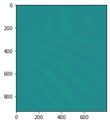


```python
out.shape
```


    (27900, 800)


```python
for q in range (1,37):
    pixel2=pixel0[::q]

    #plt.plot(pixel2)

    ans=[]
    pixel=pixel2*1.0
    for i in range(1,len(pixel)-5):
        valTemp=np.power(pixel[i+2]-pixel[i+4],2)-np.multiply((pixel[i-1]-pixel[i+3]),(pixel[i+3]-pixel[i+5]))
        ans.append(valTemp)
        #print(pixel[i+2])
    print('Distance:')
    print(q)
    plt.figure()
    plt.plot(ans)
    plt.show()
```


```python
stack0.shape
```


    (660, 40000)


```python
pixel0=im[:,553,933]
#
print(pixel0.shape)
plt.plot(pixel0)
```

    (660,)


    [<matplotlib.lines.Line2D at 0x2ac8a71f7c8>]


```python

for q in range (1,37):
    pixel2=pixel0[::q]

    #plt.plot(pixel2)

    ans=[]
    pixel=pixel2*1.0
    for i in range(1,len(pixel)-5):
        valTemp=np.power(pixel[i+2]-pixel[i+4],2)-np.multiply((pixel[i-1]-pixel[i+3]),(pixel[i+3]-pixel[i+5]))
        ans.append(valTemp)
        #print(pixel[i+2])
    print('Distance:')
    print(q)
    plt.figure()
    plt.plot(ans)
    plt.show()
```

    Distance:
    1


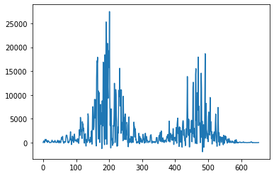


    Distance:
    2


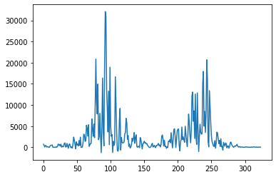


    Distance:
    3


    Distance:
    4


    Distance:
    5


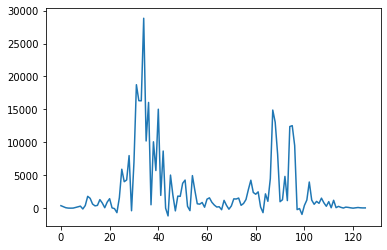


    Distance:
    6


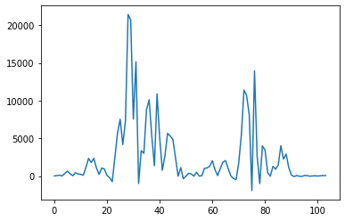


    Distance:
    7


    Distance:
    8


    Distance:
    9


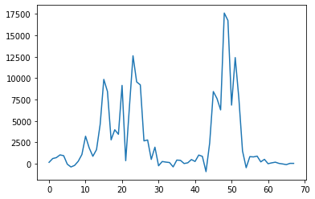


    Distance:
    10


    Distance:
    11


    Distance:
    12


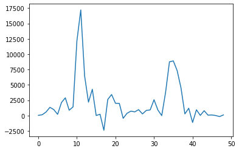


    Distance:
    13


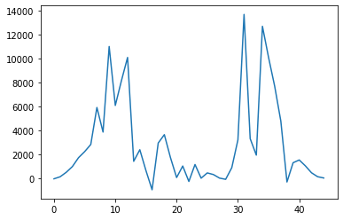


    Distance:
    14


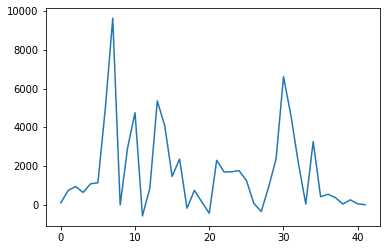


    Distance:
    15


    Distance:
    16


    Distance:
    17


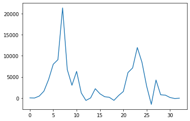


    Distance:
    18


    Distance:
    19


    Distance:
    20


    Distance:
    21


    Distance:
    22


    Distance:
    23


    Distance:
    24


    Distance:
    25


    Distance:
    26


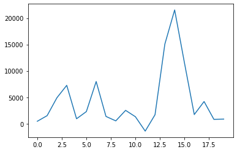


    Distance:
    27


    Distance:
    28


    Distance:
    29


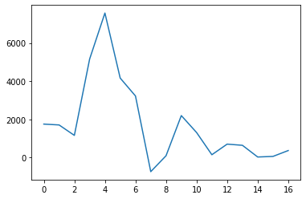


    Distance:
    30


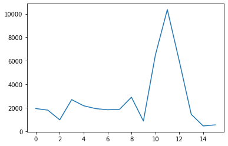


    Distance:
    31


    Distance:
    32


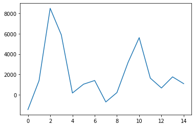


    Distance:
    33


    Distance:
    34


    Distance:
    35


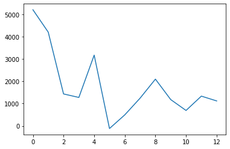


    Distance:
    36


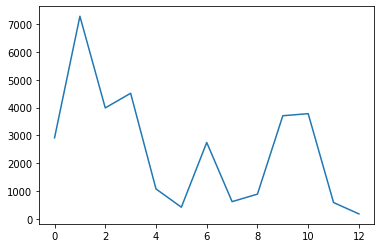


```python
plt.plot(pixel2)
```


    [<matplotlib.lines.Line2D at 0x2ac52d46648>]


```python
ans=[]
pixel=pixel2*1.0
for i in range(1,len(pixel)-5):
    valTemp=np.power(pixel[i+2]-pixel[i+4],2)-np.multiply((pixel[i-1]-pixel[i+3]),(pixel[i+3]-pixel[i+5]))
    ans.append(valTemp)
    #print(pixel[i+2])

plt.plot(ans)
```


    [<matplotlib.lines.Line2D at 0x2ac52e1bf48>]


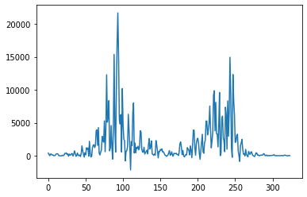


```python

```


    [<matplotlib.lines.Line2D at 0x2ac52c12388>]


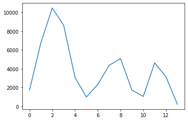


```python
import os
os.getcwd()
```


    'C:\\ProgramData\\Galaxy\\userdata\\ImagesAndVideos\\hackaday\\MER2-230-168U3M(FDG22050153)'
