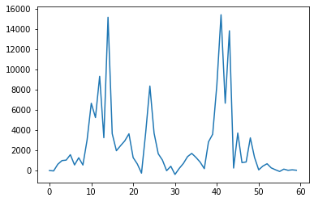

# Hackathon: openOCT - Full-field Incoherent Interferemeter for better optical sectioning with remote control capabilities

Welcome to the openOCT Hackathon! In this hackathon, we will be addressing the crucial need for an open-source optical coherence tomography system that can help students learning more about setting up a low-coherence interferemoter. To keep the budget low, we aim for a full-field time domain OCT using an SLD (super luminescent diode) - alternatively one could also try an LED to lower the costs even more


## Motivation

Optical coherence tomography (OCT) is a non-invasive optical method that allows for deep imaging within tissues. It is primarily based on a Michelson-type interferometer, where the light source is generated by a low-coherence light source, such as a superluminescent diode (SLD). The coherence volume, which represents the volume where constructive interference is observed, is inversely proportional to the spectral bandwidth of the light source.

However, adjusting a Michelson interferometer is not a straightforward process, as the lengths of the reference and sample arms need to match by approximately 10 µm. To address this challenge, a common-path-type full-field OCT is employed, where both arms are illuminated by an SLD, and the sample or mirror is imaged using a long-working distance objective or a simple lens. This alignment method simplifies the process since the "sample" or mirror is brought into focus, ensuring that the path lengths are nearly equal.


Such a system enables the estimation of depth in applications like fingertip imaging or visualization of the rods in the retina. Currently available OCT systems are expensive and not accessible to all, and thus there is a need for a more affordable and open system, which our system aims to provide.

In addition to the challenges related to alignment, adjusting such a system becomes even more complex due to the influence of touch, which can change the path lengths. To overcome this, we also intend to automate certain mechanical elements and enable remote access using the TwinLab developed by the Lichtwerkstatt, which provides WebRTC-based access to labware.

For further reading on this topic, please refer to the following sources:
- [Article 1](https://ieeexplore.ieee.org/document/8957575)
- [Article 2](https://pubs.aip.org/aapt/ajp/article-abstract/88/12/1132/859670/Full-field-optical-coherence-tomography-An?redirectedFrom=fulltext)


This will be our main guide star publication:


Further reading https://ieeexplore.ieee.org/document/8957575
https://pubs.aip.org/aapt/ajp/article-abstract/88/12/1132/859670/Full-field-optical-coherence-tomography-An?redirectedFrom=fulltext


## Goal


Our primary goal is to set up an optical coherence tomography (OCT) system based on the optical scheme depicted in the diagram. The first step is to ensure that the system is adjusted to observe interference fringes. This involves aligning the components to achieve constructive interference.


Once we have successfully obtained interference fringes, our next objective is to acquire a stack of fringes from two mirrors with varying positions. To achieve this, we plan to integrate low-cost stepper motors into one of the mirrors, allowing us to control its movement. The integration of these motors will be done in conjunction with the TwinLab, a versatile platform developed by the Lichtwerkstatt that provides remote access to labware via WebRTC.


Alternatively, we aim to develop a Jupyter notebook program that integrates the UC2-ESP32/UC2-REST framework with the low-cost stepper motors, enabling automation of the OCT system. This program will facilitate precise control over the motion of the mirrors.

To further enhance the capabilities of our OCT system, we are exploring methods to move the reference mirror along the optical axis. This can be achieved by employing a stepper motor, voice coil motor, or similar mechanism. By varying the position of the reference mirror, we can capture the typical oscillation of the interference over the Z-axis.

In order to process and analyze the acquired data, we plan to develop Python code that can reconstruct the OCT scan. This code will extract the mirror location and reflection information from the data. Additionally, we will investigate techniques to compensate for any potential non-linearity in the motion of the mirrors or stages, ensuring accurate positioning.

Finally, we intend to incorporate a sample, such as layers of coverslips, into the setup and acquire an OCT scan. This will allow us to visualize and analyze the internal structure of the sample using the OCT system.

By accomplishing these goals, we aim to create a functional and cost-effective OCT system that provides valuable imaging capabilities for various applications.


## Background

### Interference

- A phenomenon where two waves interact with each other, resulting in a visible pattern.
- Two wave trains must have a fixed phase relationship to each other.
- Temporal coherence: A light source is split and brought into interference at different times by extending the optical path accordingly.
- Spatial coherence measures the interference capability of two wavelengths from a source originating from different locations.

### OCT

OCT relies on having as small a temporal coherence as possible to increase optical sectioning. This is achieved by using a typical source such as an SLD or LED that has a broad spectrum. Multiple wavelength components interfere simultaneously. Constructive interference of all wavelengths is only visible in a range inversely proportional to the spectrum. The broader the spectrum, the smaller the range where interference can be observed. This makes alignment challenging. Our design overcomes this challenge by ensuring that as soon as we see a sharp image of the reference mirror and the sample on the detector, we are within the same optical path length and thus within the coherence volume.

## Current State: Building the Prototype and Optical Setup

We are currently in the process of building a prototype for the simplified OCT system. The setup eliminates the need for an optical table and instead is mounted on a foam mat, allowing for easier operation and portability.

### TwinLAB Integration

Johannes will tell you more about it. Here you can find some links and thoughts:

https://www.asp.uni-jena.de/digital-teaching/xr-twinlab


Sources:
https://github.com/Lichtwerkstatt/XRTL_SPA

The idea would be to integrate the UC2 system into this framework

### CAD

The Inventor DEsign Files can be found in the folder [INVENTOR](./INVENTOR)
The STL printing files can be found in the folder [STL](./STL)


### Reference Mirror

The optical setup consists of a minimal number of optical components. The reference mirror (M2) is mounted on a linear stage, enabling forward and backward movement to scan the coherence volume. It is also kinematically held to align the beam with respect to the sample. The entire scanning process will be motorized to minimize vibrations caused by manual movements.

### Light Source

Currently, we are using a Superlum SLD (Superluminescent Diode) as the light source. However, it would be interesting to explore the use of an LED due to their lower cost. For spatial incoherence, a LED with a small emitter could be considered to minimize the visible interference range. The SLD is collimated using lens L1 to illuminate the mirrors and the sample.

### Imaging Optics

The beam splitter cube or the 50% reflective mirror (approximately 1mm thick) divides and recombines the beam paths of the Michelson interferometer before passing through the 100mm objective lens (L2) and the 50mm tube lens, which takes the form of a CCTV lens. The resulting image is captured by a CMOS camera (Deheng IMX 226).

### Sample

In its simplest form, the sample is represented by a mirror mounted on a micrometer XYZ stage, allowing for controlled movement in space. To facilitate interference, it is advisable to kinematically mount the sample as well, ensuring precise alignment and stability during scanning.
### Setting up and Adapting

To disassemble the OPU, you can remove the metal plate at the back and the detection lens using Philips screwdrivers.

The back of the OPU features a complex and precisely adjusted "confocal" microscope:


*Bottom View*

To attach this unit to a 3D printed assembly, we will enlarge the holes where the lens used to be, making them M3-sized, and then incorporate the assembly into a UC2 insert:


The Xiao camera module can be adapted using another 3D printed mechanism (customizable to your needs). It's worth noting that the astigmatism is not parallel to the case of the OPU, so it may be necessary to adjust the angle by rotating the camera. Additionally, the focus may be slightly closer than the plastic cap (black) of the camera module allows.


We create an initial prototype as follows:


It is advisable to mount the XIAO camera securely to prevent damage to the flatband cable:


The laser diode can be directly powered by the 3V3 supply voltage or controlled using a transistor for on/off switching in the code.


### Code

Luckily we don't need a lot of code. Essentially we will have 3 steppers rotating the thumbscrews of the kinematic mirror mount. Then there is a non-captive stepper motor translating the linear stage.

#### Kinematic mirror mount

These are 28byj-48  stepper motors and will be driven using a ULN2003 board hooked up to our UC2-ESP firmware. The **FIRMWARE**: https://github.com/youseetoo/uc2-esp32/tree/main/main

*Three steppers mounted to the insert*


*All motor drivers hooked up the ESP32 controlled by UC2-ESP*


*Module in Action*


You can access them using the `Rotataor` class: https://github.com/youseetoo/uc2-esp32/blob/main/main/src/rotator/Rotator.cpp

**The pincofiguration** is determined here:
https://github.com/youseetoo/uc2-esp32/blob/main/main/PinConfig.h#L427
You can download the code, import it into Visual Studio's Platform.io, compile and upload it to the ESP32 board and connect the 3 ULN2003 boards to the following pins:

```cpp
    // ESP32-WEMOS D1 R32
    int ROTATOR_X_0 = GPIO_NUM_13;
    int ROTATOR_X_1 = GPIO_NUM_14;
    int ROTATOR_X_2 = GPIO_NUM_12;
    int ROTATOR_X_3 = GPIO_NUM_27;
    int ROTATOR_Y_0 = GPIO_NUM_26;
    int ROTATOR_Y_1 = GPIO_NUM_33;
    int ROTATOR_Y_2 = GPIO_NUM_25;
    int ROTATOR_Y_3 = GPIO_NUM_32;    
    int ROTATOR_Z_0 = GPIO_NUM_5;
    int ROTATOR_Z_1 = GPIO_NUM_19;
    int ROTATOR_Z_2 = GPIO_NUM_18;
    int ROTATOR_Z_3 = GPIO_NUM_21;  
```

If everything goes right, you can control the motors using our web-gui that is available here: https://youseetoo.github.io/indexWebSerialTest.html

You can control the steppers using the following python code:

In Python code that means (after `pip install UC2-REST`):

```py
import uc2rest
import numpy as np
import time

port = "unknown"

ESP32 = uc2rest.UC2Client(serialport=port, DEBUG=True)
# setting debug output of the serial to true - all message will be printed
ESP32.serial.DEBUG=True

#%%
# test Rotators
ESP32.rotator.move_x(steps=10000, speed=10000, is_blocking=True)
ESP32.rotator.move_y(steps=1000, speed=1000, is_blocking=True, is_enabled=False)
ESP32.rotator.move_z(steps=1000, speed=1000, is_blocking=True)
ESP32.rotator.move_y(steps=1000, speed=1000, is_blocking=True, is_enabled=False)
ESP32.rotator.move_t(steps=1000, speed=1000)
```


#### XYZ Stage

This video should describe some of the details for the stage's operation:


Depending how you will connect the stepper to the ESP you can simply use the flashing tool and upload the latest firmware (https://youseetoo.githu.io)

You can also use the web-tool to move the motor (https://youseetoo.github.io/indexWebSerialTest.html).


In Python code that means (after `pip install UC2-REST`):

```py
import uc2rest
import numpy as np
import time

port = "unknown"

ESP32 = uc2rest.UC2Client(serialport=port, DEBUG=True)
# setting debug output of the serial to true - all message will be printed
ESP32.serial.DEBUG=True

#%%
# test motor
ESP32.motor.move_x(steps=10000, speed=10000, is_blocking=True)
ESP32.motor.move_y(steps=1000, speed=1000, is_blocking=True, is_enabled=False)
ESP32.motor.move_z(steps=1000, speed=1000, is_blocking=True)
```

#### Camera

We use a Daheng camera. For this we would need to download the drivers:
https://dahengimaging.com/downloads/Galaxy_Windows_EN_32bits%2064bits_1.23.2305.9161.zip

After installation, you will have access to the Galaxy Viewer to get the image stream.

We can also read out frames in Python. For this we have the option to use the camera in ImSwitch. Alternatively, you can simply use the UC2-REST library shown above and some simple python lines (see also [the python SDK](Python SDK))


```py
# version:1.0.1905.9051
import gxipy as gx
from PIL import Image


def main():
    # print the demo information
    print("")
    print("-------------------------------------------------------------")
    print("Sample to show how to acquire mono image continuously and show acquired image.")
    print("-------------------------------------------------------------")
    print("")
    print("Initializing......")
    print("")

    # create a device manager
    device_manager = gx.DeviceManager()
    dev_num, dev_info_list = device_manager.update_device_list()
    if dev_num is 0:
        print("Number of enumerated devices is 0")
        return

    # open the first device
    cam = device_manager.open_device_by_index(1)

    # exit when the camera is a color camera
    if cam.PixelColorFilter.is_implemented() is True:
        print("This sample does not support color camera.")
        cam.close_device()
        return

    # set continuous acquisition
    cam.TriggerMode.set(gx.GxSwitchEntry.OFF)

    # set exposure
    cam.ExposureTime.set(10000)

    # set gain
    cam.Gain.set(10.0)

    # start data acquisition
    cam.stream_on()

    # acquire image: num is the image number
    num = 1
    for i in range(num):
        # get raw image
        raw_image = cam.data_stream[0].get_image()
        if raw_image is None:
            print("Getting image failed.")
            continue

        # create numpy array with data from raw image
        numpy_image = raw_image.get_numpy_array()
        if numpy_image is None:
            continue

        # show acquired image
        img = Image.fromarray(numpy_image, 'L')
        img.show()

        # print height, width, and frame ID of the acquisition image
        print("Frame ID: %d   Height: %d   Width: %d"
              % (raw_image.get_frame_id(), raw_image.get_height(), raw_image.get_width()))

    # stop data acquisition
    cam.stream_off()

    # close device
    cam.close_device()

if __name__ == "__main__":
    main()

```


#### Image Processing

Ultimatively, the goal is to capture a stack of images while the refernce arm is moving alon ghte optical path difference. Then image processing will help you to recover the reflection map of your sample.


## Safety

**LASER Safety/Radition** Never watch into the source directly. You may hurt your eye. Always be careful!

**Risk of Squeezing fingers** Don't hurt your fingers!


## Challenge

### Varitions

## When Goal is met?

- Control the setup using your computer
- Think about an integration into the TWINLab https://www.asp.uni-jena.de/digital-teaching/xr-twinlab
- get interference fringes
- align the system to get an OCT signal
- acquire a image stack and process it

## Ressources
- https://hackaday.com/2021/02/02/dvd-optics-power-this-scanning-laser-microscope/


## Results

Raw-data can be found here:
10.5281/zenodo.8196533

```python
import numpy as np
import matplotlib.pyplot as plt
```

```python
from skimage import io
im = io.imread('stack140.tif')
```


```python
plt.imshow(im[20,:,:])
```


    <matplotlib.image.AxesImage at 0x22e77248848>


```python
im_cut=im[:,120:1050,700:1500]
```


```python
plt.plot(im_cut[:,300,700])
```


    [<matplotlib.lines.Line2D at 0x22e774f3608>]


```python
ans=[]
stack0=im_cut[:,300,500]*1.0
for i in range(0,stack0.shape[0]-5):
    valTemp=np.power(stack0[i+1]-stack0[i+3],2)-np.multiply((stack0[i]-stack0[i+2]),(stack0[i+2]-stack0[i+4]))
    ans.append(valTemp)
```


```python
plt.plot(ans)
```


    [<matplotlib.lines.Line2D at 0x22e770c1b88>]


```python
plt.imshow(im_cut[31,:,:])
```


    <matplotlib.image.AxesImage at 0x22e77564fc8>


```python
size = im_cut.shape
im_stack=im_cut.reshape((size[0],size[1]*size[2]))


```


```python
size
```


    (35, 930, 800)


```python
plt.plot(im_stack[2,:])
```


    [<matplotlib.lines.Line2D at 0x22e7717de08>]


```python
stack0 = im_stack
```


```python
im_ft = np.fft.fft(im_cut,None,0)
```


```python
plt.imshow(np.abs(im_ft[17,:,:]))
```


    <matplotlib.image.AxesImage at 0x22e8908c248>


```python
ans=[]
stack0=im_cut[:,:,:]*1.0
for i in range(0,size[0]-5):
# i = 0
    valTemp=np.power(stack0[i+1,:]-stack0[i+3,:],2)-np.multiply((stack0[i,:]-stack0[i+2,:]),(stack0[i+2,:]-stack0[i+4,:]))
    ans.append(valTemp)
    #print(pixel[i+2])
# print('Distance:')
#print(q)

```


```python
ans=[]
stack0=im_cut[:,:,:]*1.0
for i in range(0,size[0]-5):
# i = 0
    valTemp=np.power(stack0[i+1,:]-stack0[i+3,:],2)-np.power((stack0[i,:]-stack0[i+2,:]),2)
    ans.append(valTemp)
    #print(pixel[i+2])
# print('Distance:')
#print(q)
```


```python
stack0.shape
```


    (35, 930, 800)


```python
out = np.vstack(ans)
size2=out.shape
size2[0]
```


    27900


```python
out.shape
out2 = out.reshape((35-5,930,800))
plt.imshow(out2[0,:,:])
```


    <matplotlib.image.AxesImage at 0x22e771e9f88>


```python
out.shape
```


    (27900, 800)


```python
for q in range (1,37):
    pixel2=pixel0[::q]

    #plt.plot(pixel2)

    ans=[]
    pixel=pixel2*1.0
    for i in range(1,len(pixel)-5):
        valTemp=np.power(pixel[i+2]-pixel[i+4],2)-np.multiply((pixel[i-1]-pixel[i+3]),(pixel[i+3]-pixel[i+5]))
        ans.append(valTemp)
        #print(pixel[i+2])
    print('Distance:')
    print(q)
    plt.figure()
    plt.plot(ans)
    plt.show()
```


```python
stack0.shape
```


    (660, 40000)


```python
pixel0=im[:,553,933]
#
print(pixel0.shape)
plt.plot(pixel0)
```

    (660,)


    [<matplotlib.lines.Line2D at 0x2ac8a71f7c8>]


```python

for q in range (1,37):
    pixel2=pixel0[::q]

    #plt.plot(pixel2)

    ans=[]
    pixel=pixel2*1.0
    for i in range(1,len(pixel)-5):
        valTemp=np.power(pixel[i+2]-pixel[i+4],2)-np.multiply((pixel[i-1]-pixel[i+3]),(pixel[i+3]-pixel[i+5]))
        ans.append(valTemp)
        #print(pixel[i+2])
    print('Distance:')
    print(q)
    plt.figure()
    plt.plot(ans)
    plt.show()
```

    Distance:
    1


    Distance:
    2


    Distance:
    3


    Distance:
    4


    Distance:
    5


    Distance:
    6


    Distance:
    7


    Distance:
    8


    Distance:
    9


    Distance:
    10





    Distance:
    11


    Distance:
    12


    Distance:
    13


    Distance:
    14


    Distance:
    15


    Distance:
    16


    Distance:
    17


    Distance:
    18


    Distance:
    19


    Distance:
    20


    Distance:
    21


    Distance:
    22


    Distance:
    23


    Distance:
    24


    Distance:
    25


    Distance:
    26


    Distance:
    27


    Distance:
    28


    Distance:
    29


    Distance:
    30


    Distance:
    31


    Distance:
    32


    Distance:
    33


    Distance:
    34


    Distance:
    35


    Distance:
    36


```python
plt.plot(pixel2)
```


    [<matplotlib.lines.Line2D at 0x2ac52d46648>]


```python
ans=[]
pixel=pixel2*1.0
for i in range(1,len(pixel)-5):
    valTemp=np.power(pixel[i+2]-pixel[i+4],2)-np.multiply((pixel[i-1]-pixel[i+3]),(pixel[i+3]-pixel[i+5]))
    ans.append(valTemp)
    #print(pixel[i+2])

plt.plot(ans)
```


    [<matplotlib.lines.Line2D at 0x2ac52e1bf48>]


```python

```


    [<matplotlib.lines.Line2D at 0x2ac52c12388>]


```python
import os
os.getcwd()
```


    'C:\\ProgramData\\Galaxy\\userdata\\ImagesAndVideos\\hackaday\\MER2-230-168U3M(FDG22050153)'


## License
